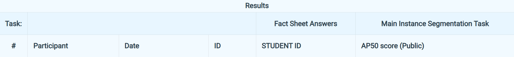

# Visual-Recognition-using-Deep-Learning-HW3
314706009 王妤瑄

## Introduction

This project tackles **instance segmentation** on colored medical cell images, targeting four cell types (class1–class4). The model is required to produce per-instance segmentation masks evaluated by **AP50**.

**Architecture: Mask R-CNN** 
- **Backbone**: ResNet-101 + FPN 
- **Anchor sizes**: `(8, 16, 32, 64, 128)` per FPN level — smaller than defaults to better capture small cells
- **Aspect ratios**: `(0.5, 1.0, 2.0)` × 5 levels
- **RoI Align**: 7×7 for box head, 14×14 for mask head
- **Trainable parameters**: ~62.7M — well under the 200M limit

Key design decisions:
1. **Smaller anchors** — default Mask R-CNN anchors are too large for dense small cells
2. **FPN** — multi-scale features handle cells of varying sizes in the same image
3. **Strong data augmentation** — ShiftScaleRotate, ColorJitter, HueSaturationValue, CoarseDropout to combat overfitting on only 209 training images
4. **Train on all data** — use all 209 images for training (no val split) to maximise data utilisation
5. **AMP (Mixed Precision)** — reduces GPU memory without affecting accuracy
6. **TTA (Test Time Augmentation)** — hflip + vflip at inference for +1~2 AP50
---

## Environment Setup

### Requirements
- Python 3.10
- CUDA 12.x (tested on RTX 4090)
- GPU with ≥ 12GB VRAM recommended (batch_size=1 works on 10GB)

### Installation

**Step 1 — Install PyTorch** (choose based on your CUDA version)
```bash
# CUDA 12.1
pip install torch torchvision --index-url https://download.pytorch.org/whl/cu121

# CUDA 12.4
pip install torch torchvision --index-url https://download.pytorch.org/whl/cu124

# CUDA 11.8
pip install torch torchvision --index-url https://download.pytorch.org/whl/cu118
```

**Step 2 — Install other dependencies**
```bash
pip install -r requirements.txt
```

### File Structure
```
hw3/
├── dataset.py        # Dataset loading & augmentation
├── model.py          # Mask R-CNN with ResNet-101 FPN backbone
├── train.py          # Training loop (AMP + loss curves, trains on all data)
├── evaluate.py       # Local COCO AP50 evaluation (full / val mode)
├── inference.py      # Test-set inference with TTA → submission JSON
├── plot_loss.py      # Re-plot loss curves from saved JSON
├── requirements.txt
└── README.md
```

---

## Usage

### 1. Train
Trains on all 209 images (no val split). Checkpoints saved every 10 epochs.
```bash
nohup python train.py \
    --data_root ./data/train \
    --output_dir ./checkpoints \
    --backbone resnet101 \
    --epochs 50 \
    --batch_size 1 \
    --lr 1e-4 > train.log 2>&1 &
```

### 2. Evaluate (local AP50)

**Full mode** — evaluate on all training images (for checking the model learned):
```bash
python evaluate.py \
    --data_root ./data/train \
    --checkpoint ./checkpoints/last_model.pth \
    --score_thresh 0.5 \
    --mode full
```
> ⚠️ `--mode full` will overestimate true test AP since the model has seen these images. Use it to verify the model is learning, not as a true benchmark.

### 3. Generate Submission (with TTA)
```bash
python inference.py \
    --test_dir ./data/test_release \
    --id_json ./data/test_image_name_to_ids.json \
    --checkpoint ./checkpoints/last_model.pth \
    --output test-results.json \
    --score_thresh 0.5 \
    --nms_thresh 0.5 \
    --use_tta
```


### 4. Re-plot Loss Curves (optional)
```bash
python plot_loss.py \
    --json ./checkpoints/loss_history.json \
    --output_dir ./checkpoints
```

---

## Performance Snapshot



---
